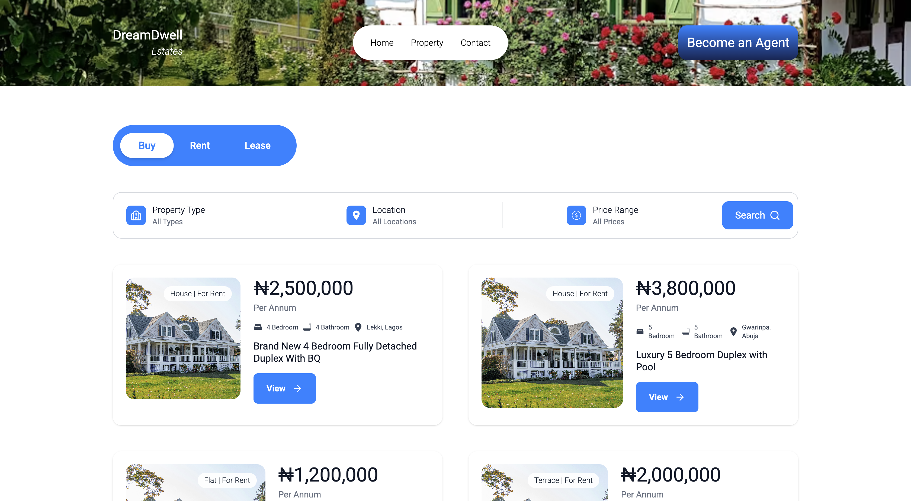

# 🏡 Housing Listings Interface



A modern, responsive housing listings interface built with React, TypeScript, Tailwind CSS, and Axios. Users can browse and search through available properties.

## Getting Started

These instructions will help you set up a copy of the project on your local machine for development and testing purposes.

### Prerequisites

Before you begin, ensure you have met the following requirements:

* [Node.js]
* [npm] or [Yarn]

### Installing

Follow these steps to get your development environment up and running:

1. Clone the repository

```bash
git clone https://github.com/JusticeOpara/worksquare-frontend-task.git
cd worksquare-frontend-task
```

2. Install the dependencies:

```bash
npm install
```

1. Start the development server:

```bash
npm run dev
```

Your application should now be running on `http://localhost:5173`.

## Deployment

To deploy this project on a live system, follow these steps:

1. Build for production:

```bash
npm run build
```

## Built With

* React
* TypeScript
* TailwindCSS
* Axios

## Trade-offs & Areas for Improvement

No pagination or infinite scroll yet — future enhancement
Used static data for filters; could be dynamic in real implementation
Lacks backend; properties are fetched from a json file

## 🧠 Notes on Approach

Focused on clarity, scalability, and user-centric design
Built reusable components with props for flexibility
Implemented basic error handling and loading states for better UX

## 📬 Feedback

If you have any feedback, please reach out to me at `justiceopara33@gmail.com`

